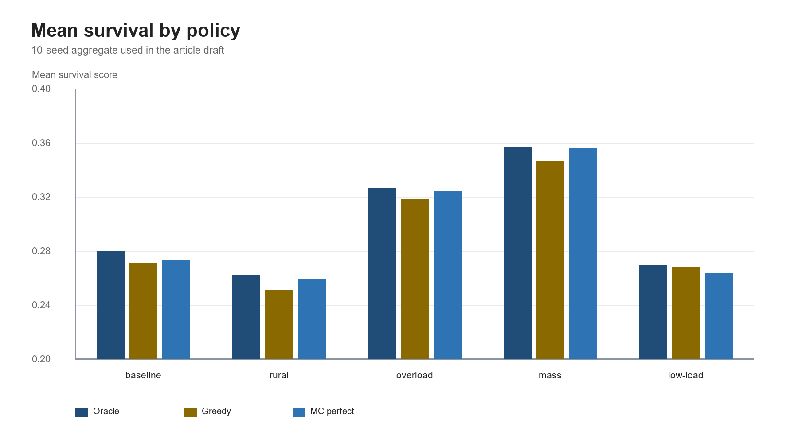
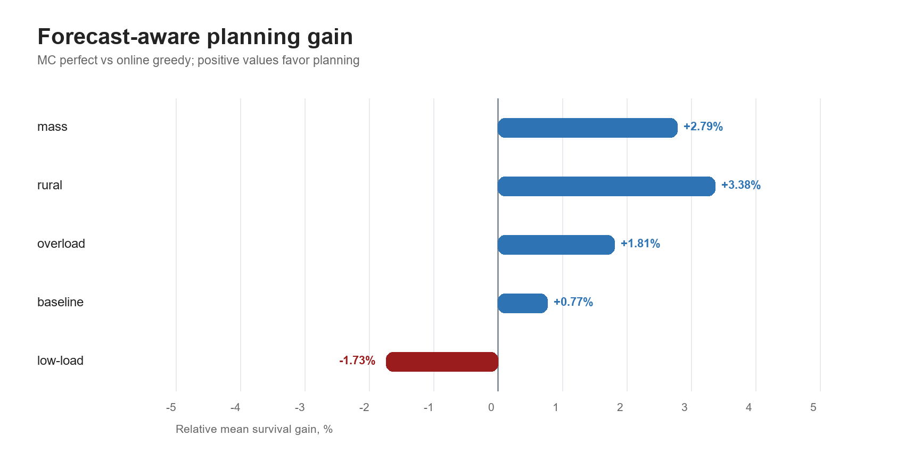
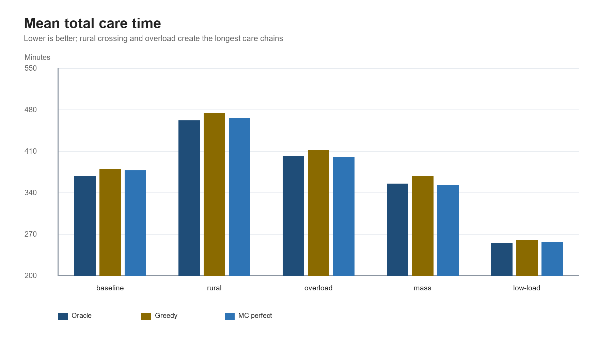
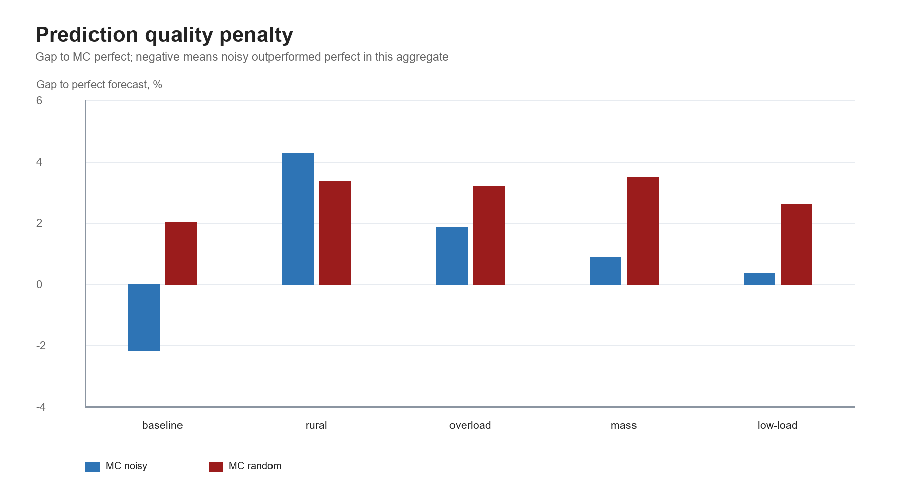
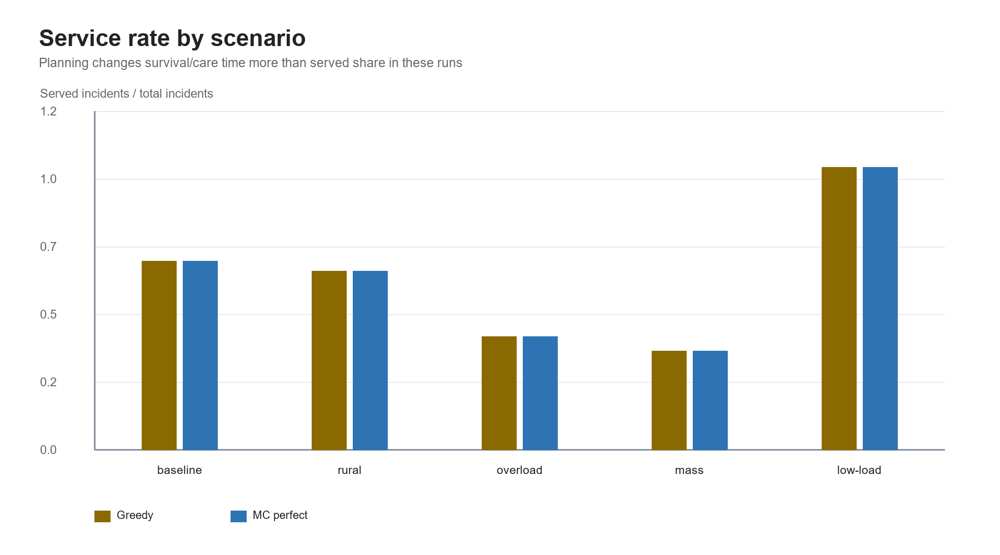

# Forecast-Aware EMS Dispatch Simulation

This repository contains a reproducible simulation study for comparing offline,
greedy, and forecast-aware online dispatch policies in an Emergency Medical
Services (EMS) transport system.

The model focuses on the full care chain, not only ambulance response time:

- ambulance dispatch to the incident scene;
- on-scene treatment time;
- transport to a feasible hospital;
- temporary transport-barrier closures, waiting, and detours;
- hospital specialty matching, quality, handover time, and remaining capacity;
- online decisions under perfect, noisy, or randomly generated future demand.

The project is intended as research code for simulation experiments, manuscript
figures, and method validation. The survival score used here is a normalized
utility function for comparing policies under identical scenarios; it should not
be interpreted as a clinically validated individual survival probability.

## Results at a Glance

The figures below reproduce the 10-seed aggregate used in the manuscript draft.
They are included directly in the repository so the README can communicate the
main result without requiring the reader to run the simulation first.

### Mean survival by policy

Forecast-aware planning is closest to the offline oracle in the overload and
mass-casualty regimes, while the low-load control case leaves little room for
planning to improve over a greedy dispatcher.



### Planning gain over greedy dispatch

The clearest gains appear when the system has a spatial bottleneck, resource
scarcity, or burst demand. In the stable low-load setting, forecast-aware
planning can be slightly worse because the greedy policy already serves all
incidents without creating meaningful downstream scarcity.



### Total care time

The model tracks the complete care chain, not only response time. Rural crossing
and overload scenarios produce longer total care times because ambulances spend
more time crossing the barrier, traveling from rural scenes, and waiting for
availability.



### Forecast quality robustness

Prediction quality matters, especially in the rural-crossing and overload
settings. Random forecasts generally degrade performance more than noisy
forecasts, although small-sample stochastic effects can appear in the baseline
case.



### Service rate

In these runs, greedy and forecast-aware planning serve nearly the same fraction
of incidents. The main difference is therefore not “more patients served”, but
better assignment of ambulances, routes, and hospitals for the patients who are
served.



## Repository Layout

```text
.
├── README.md
├── docs/
│   └── figures/
│       ├── mean_survival_by_policy.png
│       ├── planning_gain_vs_greedy.png
│       ├── mean_total_care_time.png
│       ├── prediction_quality_penalty.png
│       └── service_rate_by_scenario.png
├── pyproject.toml
├── requirements.txt
├── scripts/
│   └── make_readme_figures.py
├── src/
│   └── ems_online_planning/
│       ├── __init__.py
│       ├── __main__.py
│       ├── cli.py
│       └── simulation.py
└── tests/
    └── test_smoke.py
```

## Installation

Create a virtual environment and install the package in editable mode:

```bash
python -m venv .venv
source .venv/bin/activate  # Windows: .venv\Scripts\activate
pip install -e .
```

Alternatively, install only the runtime dependencies:

```bash
pip install -r requirements.txt
```

## Quick Start

Run a fast smoke experiment:

```bash
python -m ems_online_planning --mode smoke --seeds 1 --experiment all
```

or, after editable installation:

```bash
ems-online-planning --mode smoke --seeds 1 --experiment all
```

Run the full scenario suite with 10 random seeds and save CSV outputs:

```bash
ems-online-planning --mode full --seeds 10 --experiment all --output-dir outputs/full_10
```

Save basic figures as PNG files:

```bash
ems-online-planning --mode full --seeds 10 --experiment planning-gain --figures --output-dir outputs/full_10
```

Regenerate the static README figures:

```bash
python scripts/make_readme_figures.py
```

The static README figures are based on the manuscript's 10-seed aggregate. The
CLI-generated figures are based on the data produced by your current run.

## Experiments

The CLI supports four experiment modes:

| Experiment | Description |
|---|---|
| `grid` | Runs a custom list of policies and writes raw and summarized CSV files. |
| `oracle-gap` | Compares `offline_oracle`, `online_greedy`, and `online_mc_perfect`. |
| `planning-gain` | Compares `online_mc_perfect` against `online_greedy`. |
| `prediction-quality` | Compares `online_mc_perfect`, `online_mc_noisy`, and `online_mc_random`. |
| `all` | Runs all experiment groups. |

Example with custom policies:

```bash
ems-online-planning \
  --mode full \
  --seeds 5 \
  --experiment grid \
  --policies nearest fastest survival lookahead \
  --output-dir outputs/offline_baselines
```

## Dispatch Policies

| Policy | Meaning |
|---|---|
| `nearest` | Assigns the feasible ambulance with the shortest response leg. |
| `fastest` | Minimizes total care time for the current incident. |
| `survival` | Maximizes current incident survival utility without explicit future planning. |
| `lookahead` | Offline limited-depth lookahead over upcoming incidents. |
| `offline_oracle` | Online upper-bound policy with access to actual future incidents. |
| `online_greedy` | Online policy that maximizes current survival utility. |
| `online_mc_perfect` | Online Monte Carlo/lookahead policy with perfect forecast inside the horizon. |
| `online_mc_noisy` | Forecast-aware policy with noisy future incident predictions. |
| `online_mc_random` | Forecast-aware policy with randomly sampled future incidents. |

## Built-in Scenarios

The full suite includes:

- `baseline`: moderate load, no mass-casualty events;
- `rural_crossing`: more rural demand and longer transport-barrier closures;
- `overload`: higher incident volume, fewer ambulances, one burst event;
- `mass_casualty`: multiple burst events and constrained hospital capacity;
- `stable_low_load`: low-load control scenario with high service rate.

## Model Objective

For each feasible decision, the simulator computes total care time:

```text
T_i = W_i + R_i + S_i + D_i + H_i
```

where:

- `W_i` is ambulance availability waiting time;
- `R_i` is response time to the scene;
- `S_i` is on-scene time;
- `D_i` is transport time to hospital;
- `H_i` is hospital handover time.

The decision utility is:

```text
U_i = clip(p_i * exp(-lambda_i * T_i) * q_h * kappa_i,h, 0, 1)
```

where:

- `p_i` is the baseline survival score;
- `lambda_i` is the severity-specific time decay rate;
- `q_h` is hospital quality;
- `kappa_i,h` is the patient-hospital specialty match multiplier.

Default decay rates:

| Severity | Decay rate |
|---|---:|
| `critical` | 0.018 |
| `urgent` | 0.010 |
| `moderate` | 0.004 |

## Patient Table Input

By default, incidents are sampled from synthetic severity and patient-type
distributions. You can optionally pass a CSV file with a TRISS-like survival
column:

```bash
ems-online-planning \
  --mode full \
  --seeds 10 \
  --patient-csv data/patients.csv \
  --triss-col TRISS \
  --patient-type-col patient_type
```

Accepted patient types are `trauma`, `burn`, and `medical`. Unknown values are
mapped to `medical`.

## Outputs

CSV outputs are written to the directory passed by `--output-dir`.

Typical files:

- `grid_results.csv`
- `grid_summary.csv`
- `experiment_1_oracle_gap_results.csv`
- `experiment_1_oracle_gap_summary.csv`
- `experiment_2_planning_gain_by_scenario.csv`
- `experiment_2_planning_gain_by_regime.csv`
- `experiment_3_prediction_quality_summary.csv`

With `--figures`, PNG plots are saved under:

```text
outputs/.../figures/
```

## Testing

Install test dependencies if needed, then run:

```bash
pip install pytest
pytest
```

The smoke test verifies that the package can build a toy world and run greedy
and forecast-aware online policies end to end.

## Notes for Research Use

- `offline_oracle` is an upper-bound benchmark, not a deployable policy.
- Report paired comparisons by seed when possible.
- For publication-quality inference, save raw per-seed results and compute
  paired confidence intervals or bootstrap intervals.
- Run sensitivity analysis for decay rates, hospital quality, specialty
  multipliers, lookahead depth, forecast horizon, and forecast noise.

## License

Add the license that matches your intended release. MIT is a reasonable default
for open research code if there are no institutional constraints.
